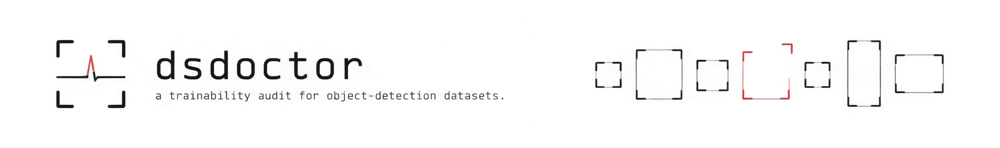

<h1 align="center">
  <picture>
    <source media="(prefers-color-scheme: dark)"  srcset="docs/banner-dark.png">
    <source media="(prefers-color-scheme: light)" srcset="docs/banner-light.png">
    
  </picture>
</h1>

<p align="center">
  <a href="https://github.com/Furqan3/dsdoctor/actions/workflows/tests.yml">
    </a>
  
  <a href="LICENSE">
    </a>
  <a href="#the-three-design-decisions-that-matter">
    </a>
</p>

> Answers one question before you spend a GPU-day on it: **is this labelled
> dataset actually safe to train on, and what has to be fixed first?**

```
$ python -m dsdoctor.cli audit ./inherited_dataset --out audit_out

auditing ./inherited_dataset with qwen3.8-27b ...

verdict: blocked
7 critical, 5 major, 0 suppressed
5 model call(s), 24 tool call(s), 138s
  report: audit_out/audit_report.md
  fix_plan: audit_out/fix_plan.json
  trajectory: audit_out/trajectory.json
```

*(Real output, on the `everything` evaluation case. Only the dataset path is
edited, for width.)*

---

## Who has this problem

An ML engineer who has just been handed a labelled detection dataset they did
not create. A vendor delivery, a dataset inherited from someone who left, a
merge of three internal collections, a Roboflow export, a client hand-off.

They have to decide *today* whether to start a training run on it.

## The bottleneck

Nothing about a dataset tells you it is broken. `data.yaml` parses. The images
open. A viewer draws boxes on pictures and they look like boxes on pictures. So
the engineer does the only thing available: opens a few dozen images, eyeballs
them, maybe writes a throwaway script for class counts, and starts the run.

The defects that matter do not show up that way.

- **Train/val leakage** has no symptom at all. The run completes, the
  validation mAP is high, and the number is a lie. You find out in production.
- **A single zero-area box** puts a NaN in the loss six hours into a run.
- **Coordinates left in pixels** by an export that skipped the normalisation
  step train the model to predict a collapsed box in the top-left corner.
- **Sub-pixel boxes** are silently dropped by the dataloader, so per-class
  coverage looks better than it is.
- **A class with two validation instances** moves the headline mAP by whole
  points on a single detection.

Every one of these is cheap to detect and expensive to discover late. The cost
is not the fixing, it is the wasted run plus the days spent not trusting a
number you cannot explain.

## Why solving it is worth something

The engineer's real question is a *decision*, not a list: train or don't. A
tool that returns forty observations sorted by detector has not answered it. A
tool that says "blocked: your val set contains three training images, fix the
split before anything else, the other six issues are cosmetic" has.


## What it does

Three commands are the core of it.

```bash
pip install -e .

# 1. deterministic checks only. no model, no network, a few seconds.
dsdoctor scan  /path/to/dataset

# 2. full audit -> triage report + ordered fix plan + trajectory
dsdoctor audit /path/to/dataset --out audit_out

# 3. apply the plan. prompts first. backs up every file it touches.
dsdoctor apply audit_out/fix_plan.json
```

`audit_report.md` opens with the verdict and the one sentence that matters,
then an ordered list of work, each item carrying the raw rows that prove it,
then a section listing what the agent decided *not* to report and why — so a
reviewer can overrule it.

Only `audit` needs a model. Everything else is deterministic and offline, and
if no endpoint is reachable `audit` says so and runs the deterministic checks
instead of failing — they are where every finding comes from anyway.

### The rest of the surface

```bash
# a health card that travels with the dataset, fingerprint included
dsdoctor card        /path/to/dataset --checks all
dsdoctor verify-card /path/to/dataset          # does this card describe THIS data?
dsdoctor recheck     /path/to/dataset          # what changed since the card

# a train/val split that cannot leak, verified after it is written
dsdoctor resplit /path/to/dataset --out /path/to/split

# COCO JSON and Pascal VOC XML, read directly
dsdoctor convert /path/to/coco_dataset --out /path/to/yolo

# compare two deliveries, or a dataset against its own repaired copy
dsdoctor diff /path/to/v1 /path/to/v2

# merge collections by class name, refusing to guess at taxonomy conflicts
dsdoctor merge /path/to/a /path/to/b --out /path/to/merged

# how much of this annotation effort can the model actually use?
dsdoctor scan /path/to/dataset --checks training --imgsz 640

# for CI: exit codes and SARIF, so findings land on the pull request
dsdoctor scan /path/to/dataset --format sarif --fail-on critical
dsdoctor scan /path/to/dataset --html report.html   # findings drawn on the pixels

dsdoctor detectors                              # every check, and its group
```

## How it works

```
                    ┌──────────────────────────────────────┐
   YOLO dataset ───▶│  6 deterministic detectors           │  no LLM, ever
                    │  structure · geometry · normalisation │  reads files
                    │  classes · duplicates/leakage · images│  directly
                    └───────────────┬──────────────────────┘
                                    │  findings, each with a stable id
                                    ▼
                    ┌──────────────────────────────────────┐
                    │  auditing agent (tool loop)          │  picks the checks
                    │  ranks · filters · explains          │  curates by id,
                    │  never retypes a finding             │  never retypes
                    └───────────────┬──────────────────────┘
                                    │  decisions: report / suppress
                                    ▼
                    ┌──────────────────────────────────────┐
                    │  suppression gate                    │  exact findings
                    │  exact detector -> refuse, in code   │  are not
                    └───────────────┬──────────────────────┘  suppressible
                                    │  only experimental claims get through
                                    ▼
                    ┌──────────────────────────────────────┐
                    │  verifier                            │  re-argues each
                    │  re-argues from the opposite prior   │  surviving
                    └───────────────┬──────────────────────┘  suppression
                                    ▼
                      report.md + fix_plan.json + trajectory.json
                                    │
                                    ▼
                          human approval  ──▶  apply
```

### The three design decisions that matter

**1. The model never generates a finding.** Every detector is a pure function
over the files, and none of them import an LLM (`grep -rn "openai" src/dsdoctor/detectors/`
returns nothing). The agent chooses which to run and what they mean. This is
why the audit cannot hallucinate a defect into a dataset.

**2. The agent curates finding *ids*, it does not retype findings.**
`submit_report` takes decisions *about ids* — keep this, suppress that, rank
this first — and anything the model never mentions is reported anyway. So the
failure mode is reduced from "loses evidence" to "mis-ranks evidence", which is
recoverable.

I built the other version to check this was worth it (`runs/ablation-retype`).
The retyping agent lost exactly one fact in 77, and it lost it like this: it
reported a missing label on `train/00000035682`, when the file is
`train/000000035682`. Eleven digits instead of twelve — it dropped a zero while
copying a filename out of a tool result it had read correctly. That single slip
hid a real defect *and* invented a file that does not exist, at 22% more output
tokens. The size of the effect is small; the point is that the curate schema
cannot produce this class of error at all, because no file list is ever
re-typed by anything.

**3. Suppression is verified — and in the shipped configuration it never has
to be.** Letting the agent drop findings is the only path by which this system
can lose a real defect, so every suppression is re-argued by a second pass that
starts from the opposite prior and reinstates anything it will not defend.

Measured, that pass does nothing here: across all twelve cases the agent
suppressed **zero** findings, so the verifier never ran, and an ablation with
it disabled (`runs/ablation-verifier`) is identical to the shipped agent on
every metric. That is not a success of the verifier — it is a consequence of
decision 1. Once the only unreliable detector was retired, every remaining
finding is a statement about bytes on disk and there is nothing left to argue
away.

Which is exactly why it was broken for most of this project without my
noticing. Forced to actually run (`runs/ablation-experimental`), it reinstated
seven correct suppressions and produced 55 false positives on a clean dataset,
for reasons that had nothing to do with its judgement — see the hot take below.
It now works: same configuration, **55 false positives → 0**.

The rule it was guarding is no longer left to it, either. Suppressing a finding
from an exact detector is refused in code rather than discouraged in a prompt,
so the verifier only ever adjudicates claims from experimental detectors. It
contributes nothing to the headline numbers and I am not going to imply
otherwise.

### What the detectors catch

| detector | defects | cost |
|---|---|---|
| `structure_scan` | missing / orphan / empty label files, malformed rows, bad `data.yaml` | fast |
| `geometry_scan` | out-of-bounds, degenerate, sub-pixel, duplicated boxes | fast |
| `class_scan` | class ids past `nc`, classes too thin to train or validate | fast |
| `normalisation_scan` | pixel coordinates never normalised | medium |
| `image_integrity_scan` | truncated / undecodable images | medium |
| `duplicate_scan` | train/val leakage, near-duplicate images (perceptual hash) | medium |
| `model_disagreement_scan` | systematic class swaps | **retired — see iteration 4** |

Those seven are the `core` group: exactly the set every number in this README
was measured with. Later checks are opt-in, via `--checks`, and stay that way
until they have been through the same twelve cases. A test enforces it
(`test_default_detector_set_is_unchanged`), because the way a results table
quietly stops being true is that someone adds a detector.

| group | detector | defects | cost |
|---|---|---|---|
| `split` | `split_scan` | class present in train but absent from val, unusable split ratio | fast |
| `metadata` | `exif_orientation_scan` | EXIF orientation tags, where stored pixels differ from what the annotator saw | medium |
| `privacy` | `privacy_scan` | EXIF GPS coordinates, absent licence/attribution | medium |
| `privacy` | `representation_scan` | a class concentrated in one capture slice | medium |
| `training` | `training_fit_scan` | objects below the network's finest stride at your `--imgsz`, images over `max_det` | fast |
| `annotations` | `provenance_scan` | one box repeated verbatim across many images, whole-frame placeholder boxes | fast |

Two more detectors, `polygon_scan` and `keypoint_scan`, are in `core` despite
arriving later. They return immediately unless the dataset's task is `segment`
or `pose`, so on the detection-only evaluation corpus they are structurally
incapable of producing a finding — and that is demonstrated by a test rather
than asserted.

The `privacy` group answers a different question from everything else here —
not *will this train*, but *may I lawfully train on this, and publish it*.
Those findings are categorised as `governance`, kept out of the trainability
verdict, and never fail a CI gate on their own. Merging the two makes both
easier to ignore.

Measured on the same provably clean 600-image corpus the rest of the
evaluation uses, the four new detectors produce **zero false positives**. The
one finding they do return on it — `missing_license` — is true: that corpus
ships no licence file.


## Results

Twelve datasets, all derived from the same provably clean 600-image corpus,
each with a known set of injected defects. Scoring is objective: an arm either
named the right defect type on the right file or it did not. There is no LLM
judge and no human grading anywhere in the evaluation.

**Primary metric: defect recall** — of the facts that were injected, how many
did the arm report.
**Secondary: false positives** (facts reported that were not true) and
**verdict accuracy** (did it reach the right train / don't-train conclusion).

The three arms get the same twelve cases, the same defect vocabulary and the
same scorer:

- **`baseline`** — one direct prompt, the brief's "one direct prompt with basic
  instructions". Gets the dataset summary, the full file listing, and the raw
  label rows for as much of the dataset as fits once room is reserved for it to
  answer.
- **`script`** — every detector, everything reported, no model at all. This is
  the brief's "simple script" baseline, and it is deliberately a strong one: it
  is the recall ceiling of the deterministic layer.
- **`agent`** — the tool-using auditor plus the verification pass. This project.

<!-- generated by eval/summarise.py from runs/main, runs/main-2, runs/main-3, runs/main-recheck -->
<!-- model: qwen3.8-27b  corpus: data/corpus_clean -->

*4 independent runs of the same twelve cases; cells show the mean with the observed range in brackets where it moved.*

### Headline

| arm | defect recall | precision | false positives | verdict correct | wall time |
|---|---|---|---|---|---|
| `baseline` (one direct prompt) | 11.3% | 5.1% | 261 | 5 / 12 | 756s [756s–758s] |
| `script` (all detectors, unfiltered) | 100.0% | 100.0% | 0 | n/a | 65s [64s–66s] |
| **`agent` (this project)** | 100.0% | 100.0% | 0 | 12 / 12 | 892s [892s–893s] |

### Cost

| arm | model calls | tool calls | prompt tokens | completion tokens | s / dataset |
|---|---|---|---|---|---|
| `baseline` (one direct prompt) | 12 | 0 | 433,934 | 15,291 | 63 |
| `script` (all detectors, unfiltered) | 0 | 0 | 0 | 0 | 5 [5–6] |
| **`agent` (this project)** | 55 | 177 | 215,372 | 33,531 | 74 |

### Per case

| case | injected facts | `baseline` | `script` | `agent` |
|---|---|---|---|---|
| `pristine` | 0 | 55 FP | 0 FP | 0 FP |
| `subtle_leak` | 6 | 0% · 10 FP | 100% | 100% |
| `export_bug` | 7 | 43% · 35 FP | 100% | 100% |
| `geometry_mess` | 12 | 8% · 59 FP | 100% | 100% |
| `structure_rot` | 11 | 9% · 10 FP | 100% | 100% |
| `corrupt_media` | 6 | 0% · 28 FP | 100% | 100% |
| `class_mapping_broken` | 7 | 0% · 2 FP | 100% | 100% |
| `thin_classes` | 2 | 100% · 9 FP | 100% | 100% |
| `duplicate_farm` | 12 | 0% · 36 FP | 100% | 100% |
| `only_minor` | 7 | 57% · 11 FP | 100% | 100% |
| `leak_and_dupes` | 15 | 0% · 4 FP | 100% | 100% |
| `everything` | 39 | 8% · 2 FP | 100% | 100% |

### Ablations

Three questions the headline table cannot answer, each run on the same corpus
and scored the same way. Full artifacts in `runs/ablation-*`.

**1. Does curating finding ids prevent evidence loss?** Same tools, same
detectors, a prompt differing only in the submit step. Four cases, 77 injected
facts.

| | recall | precision | facts lost | invented | output tokens | wall |
|---|---|---|---|---|---|---|
| curate ids (shipped) | 100.0% | 100.0% | 0 | 0 | 13,504 | 338s |
| retype findings | 98.7% | 98.7% | 1 | 1 | 16,514 | 426s |

The single lost fact is the design's whole argument in one line: the retyping
agent reported a missing label on `train/00000035682`, when the file is
`train/000000035682`. It dropped a digit while copying a filename out of a tool
result it had read correctly — hiding a real defect and inventing a
nonexistent file in the same stroke.

**2. What does the verification pass buy?** Nothing, in the shipped
configuration — the agent suppresses nothing there, so it never runs.
`agent` and `agent_noverify` are identical: 100% recall,
0 false positives both ways.

**3. What happens if the retired detector is switched back on?** This is the
run that exposed the broken verifier. Same configuration, before and after the
fix, on a corpus with **no defects in it at all**:

| | false positives on `pristine` |
|---|---|
| agent, before the verifier fix | 55 |
| agent, after | 0 |
| raw detector output, no agent | 55 |

On the busiest case the audit does not merely slow down, it ends: the
`everything` dataset with this detector enabled produces a 61,441-token prompt
against a 65,536-token window and the run fails outright — before and after
every fix.

### Reproducibility of the model arms

Four independent runs — `runs/main`, `main-2`, `main-3` and `main-recheck` —
are **identical**: same findings, same scores, same reports, for every one of
the 36 case/arm rows, confirmed by hashing the per-case results. In the tables
above the only columns carrying a range are the wall-clock ones. Nothing that
constitutes a *result* moved at all.

The fourth run is there for a second reason. It was made after a late fix to
the verifier (see the hot take), and the default path suppresses nothing, so
that fix should have had no effect on any of these numbers. Matching the three
earlier runs byte for byte is how that is demonstrated rather than asserted.

That is worth stating carefully, because I got it wrong first. Partway through
development two runs of the same clean-corpus case produced 30 and 56 invented
findings from byte-identical input, and I wrote a paragraph here explaining that
`temperature=0` does not make a served model deterministic, since continuous
batching reorders floating-point reductions. That explanation is true in
general and was not what happened. I later found a second evaluation process of
my own, orphaned to init, that had been sharing the vLLM server for an hour.
The variable was concurrency, not temperature — and once runs were serialised
the divergence disappeared entirely.

So: under the conditions in `REPRODUCTION.md` — one client, requests issued
sequentially against a dedicated server — these numbers reproduce exactly. Run
the evaluation while something else is using the same GPU and they will not,
which is worth knowing before you conclude your rerun disagrees with mine.

### Reading these honestly

The `script` arm is not a straw man and I am not going to pretend the agent
beats it on recall. It cannot: the agent reports the findings the detectors
produce, so the detectors' recall *is* the agent's ceiling, and both sit at the
top of it. Anyone who only wants a list of defects should run
`dsdoctor scan` and skip the model entirely — it takes six seconds and needs no
GPU.

What the model is for is the two columns the script arm cannot fill in. A
script has no verdict, because deciding "don't train on this" from a list of
fourteen observations is a judgement. And a script has no order, because
severity alone does not tell an engineer that three leaked validation images
matter more this morning than eighty oversized boxes.

It is worth being blunt about what that costs. Across the twelve cases the
script arm takes about a minute in total and the agent takes about fifteen, so
the model is roughly an order of magnitude more expensive for **identical**
recall and precision. If your question is "what is wrong with this dataset",
that is a bad trade and you should run `dsdoctor scan`. If your question is
"should I start this training run, and what do I do first", it is the only arm
that answers it.

The comparison that answers the brief's question — does the agentic version
improve on how this is handled today — is `agent` against `baseline`, and that
gap is where the work went.

### What the ordering actually buys

Both `script` and `agent` find the same 39 defects on the `everything` case.
Here is what the agent does with them (verbatim, from
`runs/main/reports/everything.agent.json`):

> **Do not train yet:** 3 byte-identical train/val pairs make the validation
> number meaningless, and 2 unparseable label rows, 2 out-of-range class ids,
> 2 truncated images and 2 zero-area val boxes will crash or NaN the run — fix
> these seven before anything else.

and, seven items down its ordered list:

> 20 boxes outside [0,1] in 5 train files. **17 of them are the two
> denormalised files above (fixed by normalising)**; the remaining 3 in
> train/000000377723 …

That second one is the part a severity sort cannot produce. The detectors
report `denormalised_coords` and `out_of_bounds` as two independent findings,
because that is what they are. The agent noticed that fixing the first
resolves 17 of the 20 boxes in the second, and said so — turning two pieces of
work into one. It also traced the out-of-range class ids back to a `data.yaml`
that declares `nc=15` while listing 12 names, and called the yaml the root
cause rather than a third separate defect.

None of that is new information. All of it is the difference between a list and
a plan.

### The improvement that is not in the table

`duplicate_scan` compares every image against every other image in the dataset:
**179,700 pairs** for this corpus (61,776 across the train/val boundary for
leakage, 117,924 within splits for duplicates). It finishes in **3.75 seconds**.

There is no version of the manual process that does this. An engineer paging
through a viewer is not going to notice that `val/000000221754_v1` is the same
photograph as a training image, because they will never see the two side by
side. This is the defect with the worst consequence — it silently invalidates
the number the team ships on — and the least chance of being caught by hand.


## Improvement changelog

Each entry is a change I actually made, the evidence that prompted the next
one, and what I decided.

Five of the twelve are not improvements to the tool at all.

One removes a component that measurement showed was making things worse
(iteration 4). The other four are defects in my own work: a baseline that could
not answer, so scored zero for reasons that were mine and not its (5); a
fixture that leaked the answer through filenames, letting an arm "detect"
image duplication by reading a directory listing (7); a reproducibility claim I
invented instead of investigating (10); and a verifier that was broken for
almost the entire project, in a component whose only job was to catch my
mistakes (12).

Three of those four made my solution look better than it was. That is the
direction measurement error travels when you are the one holding the ruler,
and it is why the entries below spend more space on how each number was wrong
than on how it improved.

### Iteration 1 — put a deterministic layer under the model

The first version asked the model to find defects from label text. That cannot
work: it cannot perceptually hash 600 images, and it cannot read 6,763 rows
without dropping some. Wrote six detectors as pure functions over the files,
with the model on top of them rather than in place of them.

**Evidence:** on the first mixed case, 37 of 39 injected facts recovered, 0
false positives.
**Decision:** kept. This is where essentially all of the recall comes from, and
saying so plainly is more useful than pretending the model found it.

### Iteration 2 — the two defects the detectors still missed

Both misses were `corrupt_image`. PIL's `Image.verify()` checks the container
and the header, not the scan data, so a JPEG truncated to a third of its length
passes it cleanly and then fails inside the training loop instead. Changed
`image_integrity_scan` to force a full pixel decode with
`ImageFile.LOAD_TRUNCATED_IMAGES = False`.

**Evidence:** 37/39 → 39/39, still 0 false positives.
**Decision:** kept, and pinned by
`tests/test_detectors.py::test_corrupt_image_needs_a_full_decode`.

### Iteration 3 — the evaluation substrate was the bottleneck, not the tool

The corpus was built from coco128 (128 images). `build_corpus.py` ends by
asserting the base corpus is clean, and it kept failing: classes that could not
clear 10 training and 3 validation instances were dropped, one round after
another, until only `person` survived. A single-class corpus cannot exercise
class-level defects at all.

**Evidence:** 5 successive rebuild attempts, 12 → 5 → 4 → 2 → 1 classes.
Rebuilt on 600 COCO val2017 images: 12 classes, 6,763 boxes, 468/132 split,
0 residual findings on the first attempt.
**Decision:** kept the larger corpus.
**Learning:** the fixture needed as much engineering as the thing under test,
and it was the builder's own cleanliness assertion — not inspection — that
caught it.

### Iteration 4 — added a vision-based mislabel detector, measured it, removed it

Geometry checks cannot see a *wrong class*. So I added
`model_disagreement_scan`: run a pretrained yolov8n over each image, match its
predictions to the stored labels by IoU, and flag confident disagreements. I
added a `class_swap` defect to the evaluation to go with it.

It made the system worse, though not for all the reasons I first wrote down.

**Evidence** — reproducible with `python eval/experiment_class_swap.py`, which
rebuilds this whole measurement and writes
`runs/experiment-class-swap.json`:

- On a corpus with **no swaps in it at all** the detector claimed **7 class-swap group(s) across 55 files**. Every one is a false positive: COCO's own truck/car and cup/bowl ambiguity. Acting on them would corrupt a correct dataset.
- Swept over 8 operating points against known injected swaps: best precision **16.7%** (at 46.7% recall), best recall **73.3%** (at 11.6% precision). There is no operating point worth shipping.

- It also cost the agent dearly. With the spurious findings in context, one
  audit ran past **25,000 generation tokens without ever reaching
  `submit_report`**.

**Revisited, after iterations 8 and 12.** That third bullet was partly wrong,
and it is worth saying so where I wrote it rather than quietly in a later
entry. Most of those 25,000 tokens were the loop bug in iteration 8, not the
detector. And when I finally tested the agent against this detector properly,
it filtered it *perfectly* — all seven spurious groups suppressed, zero false
positives — once the broken verifier in iteration 12 stopped overriding it. So
"the agent cannot cope with a noisy tool" was never established. What I had
actually measured was two of my own defects.

The decision does not change, but it now rests on grounds that survive:

- the detector's standalone precision is 5–17% at every operating point swept;
- it contributes **zero** true positives to the evaluation, because no method
  detects partial class swaps reliably enough to keep `class_swap` as a
  measurable defect at all;
- when the agent does filter it correctly, that costs **189s against 31s** and
  **14 model calls against 3** for the same clean dataset;
- and on a busy dataset it does not merely slow the audit down, it ends it: the
  `everything` case fails outright with a **61,441-token prompt against a
  65,536-token window**, before and after every fix.

**Decision:** removed from the default path and kept behind `--experimental`;
`class_swap` removed from the evaluation cases, because a defect that no method
can detect measures nothing except the size of the corpus.
**Evidence after:** the script arm over 12 cases went to 100% recall, 100%
precision, 0 false positives.

### Iteration 5 — the baseline was unfair three times over

A baseline that loses for the wrong reason invalidates the entire comparison.
This one took three rounds to get honest, and each round I only caught because
I opened the raw trajectory instead of trusting the score.

**Round 1 — the prompt did not fit.** The baseline was handed 90,000 characters
of raw label rows. Against a 65,536-token window that came to a **61,441-token
prompt**, and every call failed with a 400. The arm would have scored zero
because I had broken it. Label rows are digits and decimal points; they
tokenise at roughly **1 char/token**, not the ~3.5 of prose.

**Round 2 — it never got to answer.** With the prompt fixed the calls
succeeded, and the arm still returned `verdict: unknown` on every case. The
trajectories said why: `finish_reason: length`, `completion_tokens: 4096`,
**`content: ''`**. With thinking enabled the model walked the label rows one at
a time and spent its entire output budget without emitting an answer. Raising
the cap does not fix a non-terminating enumeration. With thinking disabled the
same prompt answers in **83s**.

**Round 3 — its answer was thrown away.** With thinking off, `pristine` still
scored zero. The model had produced **8,046 characters of well-formed JSON**
and been cut off mid-filename inside its first finding, so `json.loads` failed
and my parser recorded nothing. The baseline had made 30 concrete claims and I
was crediting it with none of them.

**Evidence:** `runs/*/trajectories/pristine.baseline.json` across the three
rounds — a 400 on the prompt, then `finish_reason=length` with 0 content
characters, then 8,046 content characters scored as zero findings.

**Decision:** reserve output budget rather than filling the window with input
(26,000 chars of labels, 6,144 output tokens); try the thinking-disabled call
first and fall back to the backend default; and salvage every complete finding
— plus the trailing partial one — out of a truncated answer. Six regression
tests in `tests/test_baseline_parse.py` pin each observed failure.

After the fix, the same `pristine` output yields 30 recovered claims, all of
them false positives on a dataset with nothing wrong with it. That is a real
result about the baseline. The zero was not.

**Learning:** the most flattering number in this project was an artefact of my
own harness, three times running. Any baseline result that makes your solution
look good deserves a look at the raw trajectory before it goes in a table —
and the fix is never to lower the bar for your own arm, it is to stop
handicapping theirs.

### Iteration 6 — separating what the baseline could not see from what it could not do

The fixed baseline sees 52 of 600 files: once you reserve room for the answer,
one prompt cannot hold more. That is a genuine property of the single-prompt
approach rather than a handicap, but it makes a bare recall number ambiguous —
a miss could mean "never saw the file" or "saw it and could not tell".

**Decision:** the scorer now reports recall twice, over all injected facts and
over only the facts in files the arm was actually shown
(`score(..., scope=...)`). Leakage is the case that makes the
distinction pay: no amount of extra context helps there, because detecting it
needs a pairwise image comparison rather than a longer look at label text.
On `subtle_leak` the baseline scores 0%. None of the six injected facts fell inside the 49 files it was shown, so its in-scope recall is undefined and 0% is the honest number to quote — but the point stands independently: nothing in that arm can hash an image, so more context would not have helped. Across the whole run its in-scope recall is 63.2% against 11.3% overall, which is the gap between what it could not see and what it could not do.

### Iteration 7 — the evaluation was leaking the answer through filenames

With the baseline finally working, it scored **100% on `subtle_leak`** — the
challenge case, the one defect I had said a single prompt could not possibly
find because it needs a pairwise image comparison. A result that convenient is
a bug report.

It was. My injector copied a train image into val and named it
`<stem>_v0`; near-duplicates got `<stem>_dup0`; orphaned labels were called
`orphan_000.txt`. The baseline is handed the file listing for both splits, so
it never compared a single pixel — it spotted a shared filename prefix and read
the answer straight off the directory listing.

**Evidence:** `subtle_leak`, baseline, 100% recall, one model call, no image
access of any kind. Nothing in that arm can hash an image.

**Decision:** injected files now get ordinary twelve-digit COCO-style ids drawn
from the case's seed, colliding with nothing. Four regression tests in
`tests/test_eval.py` assert that no injected filename contains `_v`, `_dup`,
`orphan`, `copy` or `leak`, and that a leaked pair shares no name or substring
with the file it was copied from.

**Learning:** this one is worth more than the fix. Every other integrity check
in this project points outward at the arms being measured — is the corpus
clean, is the ground truth right, is the baseline being given a fair shot. This
defect was in the *fixture*, it favoured the arm I expected to lose, and no
amount of staring at recall numbers would have surfaced it. What surfaced it
was a result that was too good for the mechanism that supposedly produced it.
Being suspicious of a number because the causal story does not work is a
different skill from checking the arithmetic, and it is the one that mattered
here.

### Iteration 8 — a turn that produces nothing, and the fix that was for the wrong reason

**The symptom I first saw.** The very first tool-calling probe against the
server came back with reasoning that ended *"Let's try calling it."* — and then
`content: null`, `tool_calls: null`, `finish_reason: stop`. The model had chosen
a tool and emitted nothing. I added a retry that re-issues the identical turn
with `tool_choice="required"`, so the server decodes a call through guided
decoding instead of leaving the turn empty. That was correct, and it is still
in the loop.

**The symptom it did not fix.** Reading trajectories from a full run, one case
had spent **17 turns and 1,017 seconds** going nowhere; another 7 turns and
478s. Every one of those turns was `finish_reason: length` with the full output
budget consumed and no tool call — the model had not stopped early, it had
still been *reasoning* when the budget ran out. My retry fired on all of them
and bought nothing, because forcing a tool choice does not shorten reasoning.
It just pays for another truncated turn. Across the saved trajectories the loop
burned **38 truncated turns and 33 useless retries**.

**Evidence:** `export_bug` 17 truncated turns / 1,017s / 22 model calls;
`class_mapping_broken` 7 / 478s / 12 calls, against a typical case of ~40s and
4 calls.

**Decision:** the loop now distinguishes the two by `finish_reason`.
`stop` with no call keeps the forced-tool-choice retry. `length` with no call
retries with **thinking disabled** as well, which ends the enumeration that
caused it. Three consecutive turns without a tool call abandons the loop
instead of paying for a fourth, and falls back to unfiltered detector output.
The per-turn budget also went from 2,048 to 4,096, because a `submit_report`
carrying a dozen decisions is itself ~1,600 tokens and a busy dataset could
have truncated the very report the run exists to produce.

**Evidence after:** across the twelve-case run the agent made 55 model calls in 892s total, with **1 truncated turn(s)** and 1 recovery retry(ies). The two cases that previously stalled now run at `export_bug` 201s / 7 model calls / 1 truncated turn(s); `class_mapping_broken` 67s / 5 model calls / 0 truncated turn(s).

**Learning:** the first fix worked on the case I had in front of me and was
blind to the case I did not. Both failures present identically at the call site
— no tool call, loop keeps going — and only `finish_reason` separates them. A
retry that cannot fail loudly is a retry that will happily spin: what made this
visible was not a broken result (recall was 100% throughout, the reports were
fine) but a wall-clock number that made no sense for the work being done.

### Iteration 9 — the verdict did not follow the evidence

On `geometry_mess` the agent found three zero-area boxes, wrote in its own
rationale that they "can produce NaN in IoU/loss and kill the run" — and then
set the verdict to `fix_before_training` rather than `blocked`. It had the
reasoning right and the label wrong, which is the worst combination, because
the verdict is the one line the user acts on.

**Decision:** the system prompt now derives the verdict mechanically from the
findings being reported: any critical finding means `blocked`, worst-is-major
means `fix_before_training`, otherwise `usable_with_caveats`. The scorer
derives the expected verdict from the injected ground truth by exactly the same
rule, so this is checked rather than trusted.

**Evidence:** verdict accuracy over the twelve cases — `baseline` 5/12, `agent` 12/12. The `script` arm produces no verdict at all, which is the point: a list of findings is not a decision.

**Learning:** a model asked for a summary judgement will produce a reasonable
*impression*, and an impression regresses toward the middle. If a categorical
output has to be consistent with the details, say how to compute it from the
details.

### Iteration 10 — I explained away a discrepancy instead of finding its cause

Two runs of the same clean-corpus case produced 30 and 56 invented findings
from byte-identical input. I wrote a paragraph in the README explaining it:
`temperature=0` does not make a served model deterministic, because vLLM's
continuous batching reorders floating-point reductions between runs. Every word
of that is true. It was also not the reason.

The reason was a second evaluation process of my own — launched by a command I
had lost track of, orphaned to init, writing to my own scratch directory — that
had been sharing the vLLM server for an hour. It was competing with the run I
was measuring, and both sets of timings were contaminated. Once I killed it and
serialised everything behind a guard that refuses to start a run while another
is alive, the divergence vanished.

**Evidence:** three independent full runs, `runs/main`, `runs/main-2` and
`runs/main-3`, are identical across all 36 case/arm rows and every report file
— same SHA over the per-case results. The variance I had documented was zero.

**Decision:** the README now says these numbers reproduce exactly under the
documented conditions, and warns that sharing the GPU with another client is
what breaks that. `eval/summarise.py` takes any number of run directories and
prints ranges, so the claim stays checkable rather than asserted.

**Learning:** I had a plausible, technically-correct mechanism available, and I
used it to close the question instead of to open it. The tell was that I never
asked *why now* — the same code had been reproducible ten minutes earlier. A
general explanation that would apply equally well on any day is not an
explanation of something that started happening today. That instinct would have
found the stray process in about thirty seconds, which is roughly what it cost
me to write the wrong paragraph instead.

### Iteration 11 — ablation: does curating ids actually earn its place?

The report schema asks the model for *decisions about finding ids* rather than
for the findings themselves, on the argument that a model asked to re-emit
forty findings with their file lists will quietly drop some. That was a design
decision made up front, which makes it an assertion, not a result. So I built
the other version and measured it.

`agent_retype` gets the same tools, the same detectors and a system prompt that
differs only in the submit step, where it is told to list every defect and
every affected file itself. Four cases, 77 injected facts.

| | recall | precision | facts lost | invented | output tokens | wall |
|---|---|---|---|---|---|---|
| `agent` (curate ids) | 100.0% | 100.0% | 0 | 0 | 13,504 | 338s |
| `agent_retype` | 98.7% | 98.7% | 1 | 1 | 16,514 | 426s |

The single failure is the exact one the design exists to prevent, and it is
worth quoting precisely. On the `everything` case the retyping agent reported
`missing_label_file` on `train/00000035682`. The real file is
`train/000000035682` — twelve digits, not eleven. It dropped a zero while
copying the filename out of a tool result it had read correctly.

That one slip costs twice: a real defect goes unreported, *and* the engineer is
sent to a file that does not exist. It also cost 22% more output tokens and 26%
more wall time to produce a worse answer, because re-emitting evidence is
strictly more work than pointing at it.

**Decision:** kept the curate-by-id schema.
**Learning:** the effect is small at this scale — one fact in seventy-seven —
and I want to be honest that it is not a dramatic result. What makes it worth
the design is not the size of the error but its *shape*: the curate schema
cannot produce this class of failure at all, because the file list is never
re-typed by anything. A defect that is structurally impossible needs no test
and no monitoring. That is worth more than a one-in-seventy-seven improvement,
and it is why I would make the same choice on a dataset with four hundred
findings, where the arithmetic gets much worse.

### Iteration 12 — the safety net was cutting the rope

The verifier never fires in the shipped configuration, because nothing is
suppressed there. So to find out whether it worked at all I ran the one
configuration where suppression does happen: the agent with the retired
detector switched back on (`runs/ablation-experimental`).

It was a catastrophe, and not in the way I expected.

On `pristine` — a corpus with **nothing wrong with it** — the agent did its job
exactly right. It saw all seven spurious `class_swap` groups, reasoned about
them correctly ("37 truck→car, but only …", "6/577 of train", "bidirectional
and involves visually similar classes") and suppressed all seven. Then the
verifier reinstated **all seven**, and the audit reported 55 false positives on
a clean dataset. Precision: 0.0%.

The reason was not disagreement. Every verifier call came back
`finish_reason: length`, `completion_tokens: 400`, **`content: ''`** — with
1,700–1,900 characters of reasoning behind it. Its own thinking shows it
agreeing with the auditor: *"annotation ambiguity rather than a[ swap]"*,
*"Suppression likely correct"*. It reached the right answer seven times and
never had the budget left to write it down. My `_parse_verdict` treats an
unparseable response as a failure to defend the suppression, so it reinstated
everything.

This is **the identical bug I had already found and fixed in the baseline**
(iteration 5): a reasoning model given a small output budget spends all of it
thinking and returns nothing. I fixed it in one place and never grepped for the
pattern anywhere else.

**Decision — three changes, in increasing order of importance:**

1. The verifier now calls with thinking disabled first, at 512 tokens, falling
   back to the plain call for backends that reject the switch.
2. An unparseable verifier no longer overrides the auditor. A second opinion
   you could not obtain is not evidence against the first, and the claim under
   review came from an unreliable detector to begin with.
3. **Suppressing a finding from an exact detector is now refused in code.**
   That rule had been a line in the system prompt plus an LLM asked to police
   it — which is to say, two fallible components guarding an invariant that a
   four-line check enforces absolutely. `_resolve` overrides any such
   suppression and records it. The verifier now only ever adjudicates
   experimental claims.

**Evidence after:** the identical configuration, re-run
(`runs/ablation-experimental` against
`runs/ablation-experimental-before-verifier-fix`, both kept):
**55 false positives → 0**. All seven suppressions upheld, none reinstated,
verdict correctly `usable_with_caveats`. The verifier calls now return
38–52 tokens of clean JSON instead of 400 tokens of reasoning and an empty
string.

**Learning:** two things, and the second is the one I would take to the next
project. The small one: a fail-safe default has to be chosen against the
failure that actually happens, and "reinstate when unsure" sounded protective
right up until the thing it was protecting against was its own parser. The big
one: when you find a bug that is a *class* — reasoning eats the output budget —
fixing the instance you found is half the job. I had the whole diagnosis
already written down in iteration 5 and still shipped the same defect in a
component I had described as a guard.

## The main failure mode, and the hot take

**The failure mode I hit:** I built a component to protect against a risk, was
wrong about whether it worked, and did not find out for most of the project —
because in the configuration I was testing, it never ran.

The verifier exists to re-check anything the agent suppresses, so that letting
a model drop findings cannot lose a real defect. It never fires in the shipped
configuration: with the unreliable detector retired there is nothing left to
legitimately argue away, and across twelve cases the agent suppressed nothing.
Fine — a guard that never trips is cheap.

Except it was broken. When I finally forced the one configuration where
suppression happens, the agent did its job exactly right and suppressed seven
spurious findings on a clean dataset — and the verifier reinstated all seven,
producing 55 false positives. Not because it disagreed: because it had a
400-token budget with reasoning enabled, spent all of it thinking, and returned
an empty string every time. Its own reasoning says *"annotation ambiguity
rather than a swap"*. It reached the right answer seven times out of seven and
never had room to write it down, and my parser treated silence as dissent.

That is the same bug I had already diagnosed and fixed in the baseline arm,
written up in my own changelog, and never looked for anywhere else.

**The hot take:**

> The dangerous components in an agent are not the ones that fail loudly. They
> are the ones that never run. A guard that does not fire looks identical to a
> guard that works, and it will keep looking that way for exactly as long as
> nothing tests it. Before you count a safety mechanism as part of your design,
> make it fire on purpose and watch what it does — mine turned seven correct
> judgements into fifty-five false positives the first time it was asked to
> do anything.
>
> And when you find a bug that is a *class* rather than an instance — here,
> "a reasoning model given a small output budget spends it thinking and returns
> nothing" — grep for the pattern before you move on. I fixed that once, wrote
> a paragraph explaining it, and then shipped it again in the component whose
> entire job was to catch my mistakes.

**What this cost me, and what it corrects.** I had written that a 20%-precision
tool "does not become useful by putting a smart model in front of it". My own
measurement says otherwise: once the verifier worked, the agent filtered that
detector perfectly — zero false positives on a clean corpus, with rationales
that correctly identify two-directional car/truck confusion as ambiguity rather
than a mapping bug. The detector stays retired on evidence that survives — 5–17%
standalone precision, zero true positives, 6× the runtime, and an outright
context overflow on a busy dataset — but "the agent could not cope with it" was
never true. It was two of my own defects wearing a conclusion.

The corollary I still believe, now stated so that it is falsifiable: judge a
fallible component by its contribution *net of the judgement it consumes*, and
verify that the judgement layer functions before you credit it with anything.

## What was built after the evaluation, and what is still open

Three of the items on the original "what I would build next" list are done.
They sit outside the measured configuration on purpose — the results table
describes the `core` detector set, and none of this changes it.

**The leakage check is near-linear now, and provably identical.** All-pairs
perceptual hashing was 179,700 comparisons at 600 images and roughly 50
million at 10,000, which is the size where the check stops being run at all.
Candidates now come from banded LSH. The interesting part is that the banding
is *exact* rather than approximate: two hashes within Hamming distance `d`
differ in at most `d` bits and so can disturb at most `d` of the bands, and
with more bands than the threshold at least one band must survive untouched,
so no pair within the threshold can fail to collide. The pair set is identical
to brute force — asserted over randomised trials in the test suite, and
verified to produce byte-identical findings *and* evidence strings on all
twelve evaluation cases. Hashing is threaded and cached on
`(path, size, mtime)`, in a cache directory outside the dataset, because
`scan` and `audit` are documented read-only and a cache file written into the
directory under audit would break both that promise and the card fingerprint.

**Findings can be looked at.** `--html` renders the affected images with their
boxes drawn, inlined as data URIs in one self-contained file. This is the
cheap half of "let the agent look at pixels": it does not help the model, but
it does let a person settle `empty_label_file` — deliberate background image
or dropped annotation — in about two seconds, which was the actual question.

**Leakage has an automatic fix.** `dsdoctor resplit` builds the near-duplicate
graph over the whole dataset and assigns whole connected components to one
side or the other, so no chain of near-duplication can span the split. This is
the part people get wrong: deleting the val copy of a leaked image leaves its
near-duplicates behind, and re-splitting the survivors at random re-creates
the leak from a different pair. Within that constraint the assignment is
greedy on per-class val coverage, since a leak-free split that leaves four
classes unvalidated has swapped one measurement failure for another. It writes
a new directory of symlinks, never touching the source, and re-runs the
leakage detector on its own output rather than asserting the construction is
correct.

Still open:

- **Detect partial class swaps properly.** Unchanged from before: the right
  instrument is cross-validated confident learning — train on the dataset,
  look at out-of-fold disagreement — not a general-purpose detector's opinion.
  That is a GPU-hour, not a 30-second scan, so it belongs behind an explicit
  opt-in.
- **Put the new check groups through the evaluation.** They are measured for
  false positives on the clean corpus and unit-tested for true positives on
  constructed defects, which is not the same as twelve cases with ground truth
  and a baseline. Until that exists they stay opt-in.
- **Let the *agent* look at pixels**, as opposed to the reader. Still the
  right idea and still unbuilt.

## Beyond the training run

The checks above all answer "will this train". Two additions answer questions
that no amount of mAP ever raises, and that tend to get asked for the first
time by a lawyer, after the model has shipped.

**A dataset health card.** Model cards exist; datasheets for datasets exist as
a paper and almost nowhere as tooling. `dsdoctor card` writes `health.json`
and `DATASET_CARD.md` into the dataset directory, carrying the composition,
the findings, the verdict, which checks were run — and a content fingerprint,
a SHA-256 over every file's path and contents.

The fingerprint is what makes the card more than a claim. A vendor ships it
with the delivery; the receiver runs `dsdoctor verify-card` and learns whether
the card describes the data in front of them or a different version of it,
without trusting anyone's changelog. The digest covers paths as well as
contents, so a dataset whose splits were reshuffled reads as a different
dataset — the case a naive hash-of-hashes misses. Writing the card does not
change the fingerprint of the dataset it describes, which is why it can live
inside it.

The card's verdict is a fixed severity rule, not the agent's judgement, and it
says so on its face. A card has to be reproducible by anyone, offline,
byte-for-byte. `dsdoctor audit` remains the path that adds triage.

**Governance and privacy checks.** EXIF GPS coordinates record where a
photograph was taken to within a few metres, and they travel with the dataset
into every copy and every public release long after anyone remembers they are
there. Training never reads EXIF, so stripping it costs nothing in model
quality — and `dsdoctor apply` does it by rewriting the JPEG segment structure
rather than re-encoding, so the compressed scan data comes out bit-identical.
The other check is simply whether any statement of licence or provenance
accompanies the images at all. For an inherited dataset the answer is usually
no, and "we found no restriction" is not a finding of permission.

## Closing the loop

`apply` used to be the end of the line: it rewrote label files and nothing
ever re-read them. `dsdoctor recheck` diffs the current state against a health
card and reports what was resolved, what remains, and what was introduced —
exiting non-zero on the last of those. On the `geometry_mess` case the full
loop reads:

```
$ dsdoctor card    ./ds          # verdict: blocked
$ dsdoctor apply   ./plan.json   # 3 steps, 12 files, originals backed up
$ dsdoctor recheck ./ds
  card written 2026-09-01T11:41:32+00:00, verdict blocked
  now                                     verdict usable_with_caveats

  resolved:   12
  remaining:  0
  introduced: 0
```

That last line is the one that matters. It is also the only thing that would
catch a bug in `apply` itself.

## Datasets that did not arrive in YOLO format

An inherited dataset is at least as likely to be COCO JSON or Pascal VOC XML
as it is to be YOLO text files, and a checker that reads one layout does
nothing for the others. `dsdoctor` detects the layout and reads it through a
converted view — label files and a `data.yaml` written to a cache directory,
images symlinked rather than copied — so every detector, the agent, the
scorer and the fix plan work unchanged.

**The conversion is faithful, not corrective**, and this is the part that was
easy to get wrong. A converter written for convenience clamps coordinates to
the image, drops zero-area boxes and skips annotations whose category was
never declared — and every one of those is a defect this tool exists to
report. So it normalises coordinates and nothing else. An undeclared COCO
category becomes a class id past the end of the class list, which is exactly
how `class_scan` detects the same defect natively.

The test is invariance: export a case to COCO and to VOC, read it back, and
require identical findings *and* identical affected files.

Getting there took two bugs, both found by that test rather than by reading
the code, and both worth recording because they are the same shape.

1. A box whose right edge sits exactly on the image edge — `xmax == width`,
   the ordinary way for a pixel-corner format to express it — came back a few
   float ULPs above 1.0, over the geometry detector's 1e-9 tolerance. **124
   fabricated CRITICAL findings on one 600-image case.** The fix is to snap
   overhang below half a pixel, which is not a tolerance chosen to make a
   number look good: a format whose coordinates *are* pixel corners cannot
   express "outside the image by 0.4 pixels", so anything under that is
   quantisation rather than a claim. The five real out-of-bounds boxes in that
   case overhang by 265 to 288 pixels and pass through untouched.

2. With the geometry then correct, the same finding came back — because a YOLO
   row stores centre and side while every check reconstructs corners as
   `yc + h/2`. Rounding both to the conventional 8 decimal places leaves that
   reconstruction off by up to 7.5e-9, again over the 1e-9 tolerance. Writing
   10 decimals puts the worst case at 7.5e-11 and costs two characters per
   number.

Both are instances of one class: **a converter that manufactures defects is a
worse failure than one that misses them**, because the whole premise of this
tool is that a finding corresponds to something real on disk. Neither would
have been caught by a test that only asked whether conversion ran.

## Beyond detection boxes

`Box(cls, xc, yc, w, h)` was the whole data model, which meant three of the
four task types Ultralytics ships were unreadable — and worse than unreadable:
a segmentation label file is `cls x1 y1 x2 y2 …`, so every row of one was
reported as `malformed_label_row`.

The parser now resolves a **task** — from `data.yaml`, or inferred from the
label rows — and a polygon's derived bounding box is stored in the same `Box`.
That is the design decision worth stating: every geometry, class, duplicate
and leakage check written for detection applies unchanged to a segmentation
dataset, and the polygon checks are additive rather than a parallel
implementation of the same twelve tests.

Inference is by strong majority, and the reason is a defect this evaluation
injects on purpose. A detection row with a stray trailing confidence column
has six fields; a polygon needs an odd count of at least seven. A handful of
polygon-width rows in a detection dataset is a *malformed detection dataset*,
not a segmentation one, and reinterpreting it would hide exactly the defect
`inj_malformed` exists to plant.

| check | what it catches |
|---|---|
| `polygon_too_few_points` | fewer than three points: encloses nothing, rasterises to an empty mask |
| `polygon_zero_area` | enough points to look real, all collinear |
| `polygon_self_intersecting` | crosses itself, so the interior depends on the rasteriser's fill rule |
| `keypoint_visibility_invalid` | a visibility flag that is not 0, 1 or 2 — usually a confidence score from a prediction dump |
| `keypoint_outside_box` | a visible keypoint outside the instance it belongs to |

One ordering detail is load-bearing. The classic self-intersecting polygon —
a symmetric bow tie — has a signed area of exactly zero, because its two lobes
wind in opposite directions and cancel. Testing area first reports it as
"zero area", which is true of the arithmetic and misleading about the defect.
Crossing is tested first, so the most specific diagnosis wins.

## How much of your annotation effort the model can actually use

This is the check that changes a decision rather than fixing a file, and it
needs one number the dataset does not carry: the resolution you intend to
train at.

A YOLO detection head predicts on feature maps at strides 8, 16 and 32. An
object spanning fewer than a few pixels at your `imgsz` has no cell that can
represent it. It is not a hard example; it is unlearnable at that resolution,
and every instance is counted against recall as though the model failed.

On this project's own clean COCO corpus:

| `--imgsz` | annotations too small to detect |
|---|---|
| 416 | 655 (9.7%) |
| 640 | 165 (2.4%) |
| 1280 | 0 |

That is the input to choosing between 640 and 1280, and it costs a scan rather
than two training runs. The companion check is `over_max_detections`: an image
with more ground-truth objects than the default `max_det=300` has a recall
ceiling below 1.0 that has nothing to do with the weights.

## Merging collections, which is where class corruption is born

The README's opening names three ways a dataset arrives, and one is "a merge
of three internal collections". Merging is where the class-mapping defects
this tool detects downstream are actually *created*: two collections each
label `0` as the thing they care most about, and concatenating their label
files teaches the model that a forklift and a pedestrian are one object.
Nothing looks wrong afterwards — ids are in range, files are matched — which
is exactly why it is worth catching at the moment it happens.

`dsdoctor merge` merges by **name**, never by id, and reports four
disagreements:

```
  2 class id(s) mean different things in different sources:
    id 0: forklift, person
    -> resolved by rebuilding ids from names.

  1 name(s) look like the same class spelled differently:
    Cars, car
    -> kept as SEPARATE classes. Merging them is a relabelling decision,
       and this tool does not make it for you.

  1 image(s) appear in more than one source:
    identical: source 0 train/img0 ~ source 2 train/img0
    -> after merging these are duplicates, and if the sources split them
       differently they are train/val leakage.

  6 filename(s) are used by more than one source; they will be prefixed.
```

The refusal is the point. `car` and `Cars` are almost certainly one class, and
merging them silently would invent a relabelling nobody approved, while
keeping them apart splits a class in two. Both are wrong to decide
automatically, so the merge stops and says so unless `--force` is given.

## Measuring the opt-in groups

The new groups are scored the same way the core ones are — against injected
ground truth, not against a claim. Five injectors were added and four cases,
kept in a separate suite so the headline twelve keep describing what they
described.

```
$ python eval/run_extended.py

base rate on the provably clean corpus
    missing_license               1 file(s)
    undetectable_at_imgsz        96 file(s)

case                        recall  spurious  base-rate
camera_metadata                9/9         0          0
unmeasurable_split             1/1         0          0
too_small_to_learn             6/6         0         96
annotation_template            8/8         0          0

total: 24/24 injected defects found (100%), 0 spurious finding(s)
```

The base-rate column is the honest part, and the first version of this script
did not have it. `undetectable_at_imgsz` measures a *property* rather than a
*defect*: COCO genuinely contains hundreds of sub-stride objects before
anything is injected, so scoring it naively gave a precision of 21% that
described the corpus rather than the check. Findings that the provably clean
corpus also produces are counted as neither hits nor misses, and reported in
their own column — where, for that check, they are the interesting number.

The same discipline caught a real false-positive problem during development.
`whole_frame_box` originally reported every box covering the frame and fired
thirteen times on the clean corpus, all of them COCO's `dining table`, which
genuinely does fill the frame it is photographed in. True observations, and
useless findings. It now reports the *pattern* — a share of the dataset large
enough that no photographic subject explains it — and is silent on the clean
corpus at 0.19%.

## The verifier now fires on every test run

The README's hot take is that the dangerous components are the ones that never
run, and that the fix is to make them fire on purpose and watch what they do.
That was done once, by hand.

`tests/test_verifier_fires.py` registers an experimental detector that always
fires, so suppression — the only path that reaches the verifier — happens on
every run of the suite. Eight tests drive it offline with a scripted model, in
milliseconds. One of them is the original bug:

```python
def test_a_silent_verifier_does_not_reinstate(...):
    """An empty answer is not dissent."""
    llm = VerifierLLM("", finish_reason="length")
    res = _audit(llm, clean_root)
    assert res.reinstated_total == 0, "silence was treated as dissent again"
```

Another pins the gate in front of it: an agent asking to suppress a finding
from an *exact* detector is refused in code, which is why the verifier never
fires in the shipped configuration and must keep being why.

That is the difference between a lesson written down and a guarantee.

## Six bugs in the new code, and what they had in common

Everything above shipped with tests passing. A deliberate hunt afterwards
found six defects, and they are recorded here because the pattern is the
useful part: **every one produced output that looked correct.** None crashed,
none failed a test, and four of them would have been read as working by anyone
who ran the command and glanced at the result.

| bug | what it did | why nothing caught it |
|---|---|---|
| card fingerprinted the wrong tree | `card` on a COCO delivery wrote into `~/.cache`, fingerprinted 1,201 generated files instead of the 602 received, and named a cache path as the thing it described | it printed a verdict, a digest and three file paths — a confident, complete, wrong answer |
| `strip_exif_jpeg` dropped a byte | a `while…else` set the cursor past the end when the loop finished naturally, discarding the tail | the loop normally exits at the scan marker via `break`; only a malformed JPEG reaches the other path, and those are what this tool is pointed at |
| unchecked polygons read as clean | the "too complex to verify" note was appended to the self-intersection finding, so with no crossings there was no finding to carry it | absence of a finding is indistinguishable from a pass, which is the exact thing the code comment above that constant forbids |
| template count exceeded reality | per-signature image counts were summed, so an image with two repeated boxes counted twice — a title claiming 16 affected images in an 8-image dataset | the number was plausible, and no test compared it against the dataset's size |
| `recheck` hashed everything | it built a fingerprint it never printed — 0.22s of a 2.6s command on 600 images | it was correct, just wasteful, and wall-clock time is not asserted anywhere |
| the report outlined every box red | a finding about one box among twenty drew all twenty as implicated | the picture asserted something the finding text did not, and only a person comparing the two would notice |

The fifth entry carries a seventh mistake, which was mine and not the code's.
I first measured that waste at 2.7 seconds by timing the whole `recheck`
command and attributing all of it to the hashing. It was 0.22s of a 2.6s run —
the sweep was almost all of it. The removal is still right, and matters more at
scale than 8% suggests, because the sweep's image hashing is cached on
`(path, size, mtime)` across runs while a fingerprint cannot be cached by
construction: re-reading every byte is the only thing that makes it mean
anything. But the number I first wrote down described my stopwatch rather than
the code, which is the same error as iteration 10.

The first and the third are the ones worth keeping. The card bug broke the
single property the feature exists for — a receiver being able to check that a
card describes the data in front of them — and it broke it while looking like
it worked. The polygon bug is the same failure as the verifier in iteration
12, in new code, written by someone who had just finished writing a paragraph
about it: **a guard that does not run is indistinguishable from a guard that
works.** I wrote "an unchecked shape must not read as a clean one" in a comment
directly above the code that let an unchecked shape read as a clean one.

Findings now carry `locations` — the label rows a finding is actually about —
so the visual report can outline the implicated annotation and draw the rest
in grey. Where a check does not know which row it means, nothing is drawn in
red, because claiming a precision the finding does not have is the same error
pointing the other way.

All six have regression tests in `tests/test_bug_regressions.py`.

## Safety

The brief asks for consequential actions to be gated. They are.

- `audit` and `scan` are **read-only**. Neither writes to the dataset.
- `apply` refuses to run without an interactive `apply` typed at the prompt,
  backs up every file before touching it, and prints the backup path.
- Steps marked `requires_human_review` are **never** applied automatically —
  a class remap is a judgement about what the images show, and this tool has
  not looked at the images.
- Six of fourteen fix actions are deliberately not automatable at all; they are
  described and handed to the engineer.

Everything added since keeps the same line:

- `card`, `verify-card`, `recheck`, `diff`, `resplit` and `convert` never write
  to the dataset either. `resplit` writes a *new* directory of symlinks;
  `convert` writes to a cache directory; the perceptual-hash cache lives
  outside the dataset for the same reason. `tests/test_apply.py` asserts the
  read-only property across every check group, including the optional ones —
  an optional check is exactly where a stray write would go unnoticed.
- `strip_exif_metadata` is automatable because it is lossless: it rewrites the
  JPEG segment structure and leaves the compressed scan data bit-identical,
  rather than re-encoding through an image library. Verified by comparing
  pixels before and after.
- `bake_exif_orientation` is deliberately **not** automatable, for the mirror
  of that reason: rotating a JPEG to match its orientation tag means
  re-encoding it, and silently degrading every image in a dataset to fix a
  metadata flag is not a trade this tool gets to make on someone's behalf. It
  is described, with the lossless tool to do it with, and handed over.
- The CI gate fails on trainability findings only. A licensing question should
  not turn a build red — that teaches people to weaken `--fail-on`, which
  loses the trainability gate too.

## Licence

Apache-2.0. See [LICENSE](LICENSE), and [NOTICE](NOTICE) for the one thing
worth reading before you `pip install`: the core package depends only on
permissively licensed libraries, but the optional `vision` extra pulls in
Ultralytics, which is AGPL-3.0. That extra exists solely for the retired
`model_disagreement_scan`. Do not install it unless AGPL-3.0 is acceptable in
your context.

## Data provenance

Nothing in this repository redistributes data. `eval/build_corpus.py` downloads
at build time:

- **COCO 2017 YOLO-format labels** — via Ultralytics `coco2017labels.zip`.
  COCO annotations are CC BY 4.0.
- **600 val2017 JPEGs** — direct from `images.cocodataset.org`. Images are
  Flickr-sourced under their original licences.
- **yolov8n.pt** (only for the retired experiment) — Ultralytics, AGPL-3.0.

No private, personal or client data is used anywhere in this project.


## Coding-agent disclosure

The hackathon requires coding-agent use and requires it to be disclosed. This
project was built with one.

| | |
|---|---|
| **Coding agent** | Claude Code (CLI) |
| **Model** | Claude Opus 5 |
| **Sessions** | 2, across 28–29 August 2026 |
| **Traces** | `agent-traces/claude-code-*.jsonl`, submitted alongside this repository |

**How it was used.** I chose the problem, the framing and the evaluation
design, and directed the work throughout. The agent wrote the implementation,
ran the evaluation, and — the part that mattered most — read back its own run
artifacts and found defects in them. Four of the twelve changelog entries are
failures it caught in this project's *own* measurement rather than in the tool:
a baseline that was being scored on a truncation, a fixture that leaked the
answer through filenames, a reproducibility claim invented instead of
investigated, and a verifier that was silently reinstating correct judgements.

**Reading the traces.** They are JSONL, one message per line, in Claude Code's
native session format. Each line has a `type` (`user` / `assistant`), and
assistant lines carry `message.content` blocks including `tool_use` and their
`tool_result` responses. The interesting stretches are where a measured result
was questioned rather than accepted — searching for `subtle_leak`,
`finish_reason`, `verifier` or `identical` lands in the middle of each.

**Redaction.** The traces are supplied scrubbed: GitHub tokens, API keys,
private keys and SSH public keys are replaced with `[REDACTED-*]` markers, per
ground rule 8. Seven redactions were applied, all in the later session, all a
GitHub personal-access token that was pasted into the terminal while setting up
this repository. That token has been revoked. Nothing else was altered — the
transcripts are otherwise complete, including the mistakes.

## What existed before this hackathon, and what I added

**Existed:** Python, PyTorch, Ultralytics, vLLM, the Qwen3.8-27B checkpoint,
the OpenAI Python client, COCO, my own already-running local vLLM server, and
Claude Code as the coding agent (see the disclosure above).

**Written for this hackathon:** every line in `src/` and `eval/` — the dataset
model, all eight detectors, the perceptual-hash leakage check, the tool surface,
the agent loop, the verifier, the single-prompt baseline, the corpus builder,
the defect injector, the scorer, the report renderer and the gated apply path.

## Repository map

```
src/dsdoctor/
  dataset.py        YOLO dataset model; forgiving parser (broken input is the input)
  findings.py       the shared defect vocabulary - the reason scoring is objective
  detectors/        the deterministic checks. no LLM in this directory.
  tools.py          the tool surface; curate-by-id report schema
  agent.py          the tool loop, the system prompt, the verifier
  baseline.py       the one-direct-prompt baseline
  report.py         audit_report.md + fix_plan.json
  htmlreport.py     self-contained visual report; boxes drawn on the pixels
  apply.py          human-gated fixes with backups; lossless EXIF stripping
  sweep.py          run the detectors; shared by every non-agent command
  card.py           health card, content fingerprint, verification
  output.py         JSON and SARIF, for pipelines
  resplit.py        leak-free split by near-duplicate component
  merge.py          merge by class name, reporting conflicts before they land
  progress.py       terminal-only progress; never touches stdout
  formats/          COCO JSON and Pascal VOC XML -> a YOLO view
  cli.py            scan / audit / apply / card / verify-card / recheck /
                    diff / resplit / merge / convert / detectors
tests/              218 offline tests: detectors, injector round trip, scorer,
                    agent-loop recovery, baseline parsing, safety gate,
                    check-group isolation, format invariance, fingerprinting,
                    LSH-vs-brute-force equivalence, CLI exit codes, polygon
                    and keypoint geometry, merge conflict detection, and a
                    forced-suppression suite that makes the verifier fire,
                    and one regression test per bug found after shipping
eval/
  build_corpus.py   builds a provably clean corpus, fails if any finding remains
  injector.py       injects known defects, emits ground truth
  cases.py          the twelve evaluation cases
  score.py          objective (type, file) matching. no LLM judge.
  run_eval.py       runs all arms, writes scores + trajectories
  experiment_class_swap.py  reproduces the retired experiment in iteration 4
  summarise.py      regenerates the results tables in this README
  run_extended.py   scores the opt-in check groups, with base-rate separation
  render_trajectory.py      turns a trajectory into readable Markdown
runs/               evaluation output, including every agent trajectory
.github/workflows/  a dataset check that gates a pull request
```

See **[REPRODUCTION.md](REPRODUCTION.md)** to run all of it from a clean
environment.

